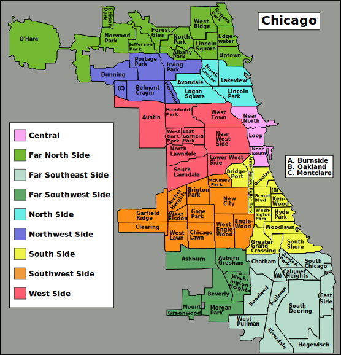

```{r setup, include=FALSE}
# Since this is a report, don't include code unless otherwise specified
knitr::opts_chunk$set(echo = FALSE, warning = FALSE, message = FALSE)

suppressPackageStartupMessages({
  library(tidyverse) # Standard stuff
  library(glue) # String concatenation
  library(igraph) # Networks
  library(tidygraph) # Tidy networks
  library(ggraph) # Tidy network visualization
  library(sf) # Geospatial data
  library(tmap) # Maps
  library(ggrepel) # For repelling text on plots
  library(units) # Because cca_flows has a `distance` column in meters
  library(statnet) # For `network` class
  library(intergraph) # Convert igraph to network
  library(ergm.count) # Like ergm, but for valued network
})
```

```{r load-data, echo = FALSE}
# Before running this, run `01-fetch.R`, `02-tracts.R`, and `03-community-areas.R` (in that order)
# to fetch and process the data.

data_dir <- file.path("data")
# tracts <- read_sf(file.path(data_dir, "tracts.geojson"))
ccas <- read_sf(file.path(data_dir, "ccas.geojson"))
cca_flows <- read_csv(file.path(data_dir, "cca_flows.csv"), col_types = "ccid")
```

# Background


# Data sources

## LODES

The network data for this project comes from the Longitudinal Employer-Household
Dynamics (LEHD), a program of the Center for Economic Studies at the U.S. Census Bureau.
They maintain the LEHD Origin-Destination Employment Statistics (LODES), which records the
number of people who live in one census block and work in another for year from 2002 to 2022.
The complete data represent a longitudinal, directed, weighted network with millions of nodes.

For this project, I'm only using the LODES for one city—Chicago—and one year—2022. The `01-fetch.R` script fetches these
data from the LODES FTP server ([https://lehd.ces.census.gov/data/lodes/LODES8/](https://lehd.ces.census.gov/data/lodes/LODES8/)).

## Additional data sources

The `01-fetch.R` script fetches two additional data sources that are used in my analysis
and visualizations. First, we need the census tract geographic shapes, which are provided by the TIGER API.
[Here is the documentation.](https://www.census.gov/programs-surveys/geography/technical-documentation/complete-technical-documentation/tiger-geo-line.html)
Second, since my analysis occurs at a neighborhood level, we need a way to crosswalk from census tracts
to Chicago community areas (CCAs). [UChicago's Spatial Data
Resources](https://guides.lib.uchicago.edu/c.php?g=720045&p=8072546) provides a file with the boundaries of all
Chicago community areas that we can use for this purpose.

Chicago has 77 community areas as of 2025:



<!-- At some points in my analysis, I include a 78th node named `"OUTSIDE CHICAGO"` to keep track of the number of
residents in each CCA who work outside Chicago and the number of workers in each CCA who originate from outside Chicago. -->

# Preprocessing

After `01-fetch.R` saves these three data sets to files in the `data/` directory, the `02-tracts.R` and
`03-community-areas.R` perform the following preprocessing steps:

1. Aggregate commuting flows from the census _block_ level to the census _tract_ level.
2. Determine each tract's corresponding commuting area (CCA) by finding the commuting area
   that the tract's centroid falls within.
3. Aggregate commuting flows from the census tract level to the CCA level. All tracts
   outside Chicago are coded as `"OUTSIDE CHICAGO"`.
4. Compute some useful statistics for CCAs:
   a. Pairwise distances of all CCAs
   b. Total number of people who live in this CCA and work anywhere in Illinois
   c. Total number of people who live in this CCA and work in Chicago
   d. Number of people in both live and work in this CCA (i.e., don't commute) 
   e. Total number of people who work in this CCA
   f. Total number of people from Chicago who work in this CCA
   g. Average distance that workers from this CCA commute
   h. Median distance that workers from this CCA commute

Finally, the processed data are saved to `data/ccas.geojson` and `data/cca_flows.csv`.

# Exploring the data

## Where people who live in a given CCA work?

One simple result we can draw from this dataset is simply where people who live in
any given commuting area work. For example, below we compare the commuting flows for
residents of Hyde Park and Woodlawn. Hyde Park and Woodlawn are adjacent, but
because Hyde Park is home to the University of Chicago, most of its residents work there.
Woodlawn, on the other hand, has a shortage of local jobs, so most Woodlawn residents
commute to the Loop.

```{r where-people-work-functions, echo = FALSE}
where_do_people_work <- function(cca) {
  cca_flows %>%
    filter(from == cca) %>%
    select(to, n) %>%
    arrange(desc(n))
}
where_do_people_work_plot <- function(cca) {
  # For debugging:
  # cca <- "Woodlawn"
  
  where_do_people_work(cca) %>%
    filter(to != "OUTSIDE CHICAGO") %>%
    mutate(is_source = to == cca) %>%
    # Put the source community last so that its borders are on top (plotted last)
    arrange(is_source) %>%
    # Must be left_join so that OUTSIDE CHICAGO is left out
    left_join(ccas, by = c("to" = "name")) %>%
    # If you want to use a log scale, try this
    # mutate(log_n = log10(n + 1)) %>%
    st_as_sf() %>%
    tm_shape() +
    tm_polygons(
      fill = "n",
      fill.legend = tm_legend(title = "Number of Workers"),
      col = "is_source",
      col.scale = tm_scale_categorical(values = c(`TRUE` = "red", `FALSE` = "lightblue", `NA` = "lightblue")),
      col.legend = tm_legend_hide(),
      lwd = "is_source",
      lwd.scale = tm_scale_categorical(values = c(`TRUE` = 2, `FALSE` = 0.5)),
      lwd.legend = tm_legend_hide(),
    ) +
    tm_title(
      glue("Where do {cca} residents work?"),
      size = 1.5
    )
}
where_do_people_work_plot("Woodlawn")
where_do_people_work_plot("Hyde Park")
```

## Node-link network diagram

When we load the CCA commuting flows into `igraph`, here is what we get:

```{r igraph}
cca_graph <- tbl_graph(edges = cca_flows) %>%
  # For some reason simply passing `nodes = community_areas` doesn't work
  left_join(ccas, by = "name") %E>%
  # Make edges weighted
  mutate(weight = n)

cca_graph %>% summary()
```

Notice that the number of edges is exactly the number of nodes squared. This is
because all dyads are included in this network, even those that have zero
commuting flow. The maximum number of edges is $n^2$ rather than $n(n-1)/2$ because
self-edges are allowed.

Here is a plot of the network with nodes colored according to their distance from
the Loop:

```{r network-plot, fig.width=8, fig.height=8}
cca_graph %N>%
  filter(name != "OUTSIDE CHICAGO") %>%
  activate(edges) %>%
  mutate(weight = n) %>%
  filter(weight > quantile(weight, 0.6)) %>% # Keep only the biggest flows
  ggraph(layout = "fr") +
  geom_edge_link(
    aes(edge_alpha = weight),
    edge_width = 0.2, edge_color = "#000",
  ) +
  geom_node_point(aes(color = distance_from_loop), size = 3) +
  geom_node_text(aes(label = name), repel = TRUE, size = 3) +
  theme_void() +
  labs(
    title = "Commuting Flows Between Chicago Community Areas",
    color = "Distance from the Loop",
    edge_alpha = "n"
  )
```

The black dot in the middle is the Loop (downtown Chicago). The out-of-place 
lighter blue dot near the central part of the network is O'Hare, which employs a lot of
people despite being far from downtown.

## In and out degree

In degree (number who work in this community area) is recorded in the `w_total` column:

```{r in-degree}
ccas %>%
  as_tibble() %>%
  select(name, w_total) %>%
  filter(name != "OUTSIDE CHICAGO") %>%
  arrange(desc(w_total)) %>%
  head(6)
```

```{r in-degree-plot}
ccas %>%
  filter(name != "OUTSIDE CHICAGO") %>%
  tm_shape() +
  tm_polygons(
    fill = "w_total",
    fill.legend = tm_legend(title = "Jobs"),
    fill.scale = tm_scale_continuous_log10(values = "viridis"),
  )
```

The commuting areas with the most jobs are those in the central city (the Loop, Near North
Side, Near West Side, and West Town) or those that contain a major employer (O'Hare
and Hyde Park).

Out degree (number of workers who live in this community area) is recorded in the `h_total` column:

```{r out-degree}
ccas %>%
  as_tibble() %>%
  select(name, h_total) %>%
  filter(name != "OUTSIDE CHICAGO") %>%
  arrange(desc(h_total)) %>%
  head(10)
```

```{r out-degree-plot}
ccas %>%
  filter(name != "OUTSIDE CHICAGO") %>%
  tm_shape() +
  tm_polygons(
    fill = "h_total",
    fill.legend = tm_legend(title = "Employed Residents"),
    fill.scale = tm_scale_continuous_log10(values = "viridis"),
  )
```

Out degree isn't characterized by a few extreme outliers like in degree is. However, notice the
clear trend on the map: North Side neighborhoods tend to have more working residents than South Side
neighborhoods, where unemployment tends to be higher.

```{r in-out-degree-scatter}
ccas %>%
  select(name, w_total, h_total) %>%
  filter(name != "OUTSIDE CHICAGO") %>%
  ggplot(aes(x = h_total, y = w_total)) +
  geom_point() +
  # geom_smooth(se = FALSE, method = "lm", size = 0.5) +
  geom_text_repel(aes(label = name), size = 2, max.overlaps = 2) +
  scale_y_log10() +
  theme_minimal() +
  labs(
    title = "In Degree vs. Out Degree",
    x = "Employed residents (out degree)",
    y = "Jobs (in degree)"
  )
```

Not surprisingly, neighborhoods with more working residents tend to also have more jobs.

## Eigenvector centrality

```{r eigen}
# Compute eigenvector centrality
cca_graph <- cca_graph %N>%
  filter(name != "OUTSIDE CHICAGO") %>%
  mutate(eig_centrality = centrality_eigen(weights = n, directed = FALSE))

# Also update the CCAs data frame
ccas <- cca_graph %>%
  as_tibble() %>%
  select(name, eig_centrality) %>%
  right_join(ccas, by = "name") %>%
  st_as_sf()

# Print the most central neighborhoods
ccas %>%
  as_tibble() %>%
  select(name, eig_centrality) %>%
  arrange(desc(eig_centrality)) %>%
  head(10) %>%
  print()

# Plot a map of eigenvector centrality
ccas %>%
  filter(name != "OUTSIDE CHICAGO") %>%
  tm_shape() +
  tm_polygons(
    fill = "eig_centrality",
    fill.legend = tm_legend(title = "Eigenvector Centrality"),
    fill.scale = tm_scale_continuous(values = "viridis"),
  )
```

The node with highest eigenvector centrality is the Loop, followed by the neighborhoods
north and west of the Loop. South Side community uniformly have very low eigenvector
centrality.

The plot below highlights the relationships between eigenvector centrality and geographic
location.

```{r eigen-vs-distance}
cca_graph %N>%
  as_tibble() %>%
  mutate(area = if_else(
    st_centroid(geometry) %>% st_coordinates() %>% .[, 2] >=
      st_centroid(filter(ccas, name == "Near West Side")$geometry) %>%
        st_coordinates() %>%
        .[, 2],
    "Northern",
    "Southern"
  )) %>%
  arrange(desc(eig_centrality)) %>%
  ggplot(aes(x = distance_from_loop, y = eig_centrality)) +
  geom_point(aes(color = area)) +
  geom_smooth(se = FALSE, method = "lm", size = 0.5, color = "black", formula = y ~ x) +
  # geom_smooth(aes(color = area), se = FALSE, method = "lm", size = 0.5) +
  geom_text_repel(aes(label = name), size = 2) +
  scale_y_log10() +
  scale_color_brewer(palette = "Set1") +
  theme_classic() +
  labs(
    title = "Eigenvector Centrality vs. Distance from the Loop",
    subtitle = '"Northern" neighborhoods are those that are at least as far north as the Near West Side.',
    x = "Distance from the Loop (m)",
    y = "Eigenvector Centrality",
    color = "Area"
  )
```

## Local jobs availability

This plot shows the number of local jobs per working resident in each community area. In neighborhoods
with the largest employment, like O'Hare and the Loop, there are many more jobs than working
residents. By contrast, many neighborhoods have nearly ten times as many working residents as jobs,
so almost everyone must commute.

```{r jobs-availability}
ccas <- ccas %>%
  mutate(jobs_availability = w_total / h_total)

ccas %>%
  # filter(name != "Loop", , name != "Ohare") %>%
  # mutate(pct_work_in_same = work_in_same / w_total * 100) %>%
  tm_shape() +
  tm_polygons(
    fill = "jobs_availability",
    fill.legend = tm_legend(title = "Jobs Availability"),
    fill.scale = tm_scale_continuous_log10(values = "viridis"),
  )
```

## Distance and flow size

Intuitively, we would expect that commuting is higher between neighborhoods that are closer together.

```{r distance-vs-size}
cca_flows %>%
  filter(from != "OUTSIDE CHICAGO", to != "OUTSIDE CHICAGO") %>%
  # Zero flows don't work with the log scale
  filter(n != 0) %>%
  # Setting amount = 1 makes the y-scale get wacky
  ggplot(aes(x = distance, y = jitter(n, amount = 0.99))) +
  # geom_density2d_filled() +
  geom_point(size = 1, alpha = 0.3) +
  # geom_smooth(se = FALSE, method = "lm", size = 1, color = "steelblue") +
  # scale_x_log10() +
  scale_y_log10() +
  # scale_y_continuous(limits = c(0, 100)) +
  theme_minimal() +
  guides(fill = "none") +
  labs(
    title = "Distance vs. Flow Size",
    x = "Distance (m)",
    y = "Flow Size"
  )
```

# Modeling Commuting Patterns with an ERGM

Modeling this dataset with an exponential random graph model (ERGM) would help understand what factors determine where people
work. However, the ERGMs we learned about in class only work with unweighted networks.
Krivitsky (2012) extended the ERGM framework to networks with values that represent counts,
which is what we have here.

```{r ergm-setup, echo = TRUE}
chicago_only <- cca_graph %N>%
  filter(name != "OUTSIDE CHICAGO")

net <- asNetwork(chicago_only)

# Add node covariates
net %v% "residents_log" <- log(chicago_only %N>% pull(h_in_chicago))
net %v% "workers_log" <- log(chicago_only %N>% pull(w_from_chicago))

# Network covariate: geographic distances
# Make a full distance matrix. Recall that all dyads are represented in
# cca_flows, not just non-zero edges.
D <- cca_flows %>%
  filter(from != "OUTSIDE CHICAGO", to != "OUTSIDE CHICAGO") %>%
  select(from, to, distance) %>%
  pivot_wider(names_from = to, values_from = distance) %>%
  column_to_rownames("from") %>%
  as.matrix()
```

```{r ergm-1, eval = FALSE}
fit0 <- ergm(
  net ~
    sum + # baseline intensity
    nonzero + # sparsity
    nodeocov("residents_log") + # origin size effect
    nodeicov("workers_log"), # destination size effect
  reference = ~Poisson,
  response = "n",
  estimate = "MPLE"
)
```

```{r ergm-2, eval = FALSE, echo = TRUE}
fit1 <- ergm(
  net ~
    sum + # baseline intensity
    nonzero + # sparsity
    nodeocov("residents_log") + # origin size effect
    nodeicov("workers_log") + # destination size effect
    edgecov(D), # deterrence by distance
  reference = ~Poisson,
  response = "n",
  estimate = "MPLE"
)

summary(fit1)
```

# Thinking forward

## Plan

Research question: **Do commuting patterns at the start of the 21st century help explain why
some Chicago neighborhoods experienced greater economic improvement over the following two decades?**

Dependent variable: Change in neighborhood prosperity 2002-2022. Could be measured by:
- Unemployment rate
- Poverty rate
- Median household income
- Vacant lot share
- A composite index of some or all of the above

Independent variable: Commuting network measures. Could include:
- Eigenvector centrality.
- Outflow entropy (diversity).
- Inbound job density. Number of inbound commuters per local resident.
- Tie strength to high-opportunity areas: weighted sum of outbound commuters to high-income
  job zones.
- Commuting asymmetry (workers in vs workers out)

Next steps:
1. Modify data fetching code to get LODES for 2002.
2. Fetch data (ACS? Census?) for poverty rate and average rent in 2002 and 2022.
3. Computer dependent variables (change in poverty rate).
3. Compute network independent variables.
4. Fit an awesome model
5. Interpret results

## Loose ideas

- Get some covariate data:
  - Populations
  - Cost of living (average rent, probably)
  - Median income?
- Spatial autocorrelation models
- Experiment with some community-finding algorithms
- Get longitudinal data. See what's changed in the past 20 years.
- Entropy
- Probably outside the scope of this project (avenues for future work):
  - Analyze multiple cities
  - Include entire commuting area (suburbs) in the analysis
  - Use RSiena to do the same thing with a better model
